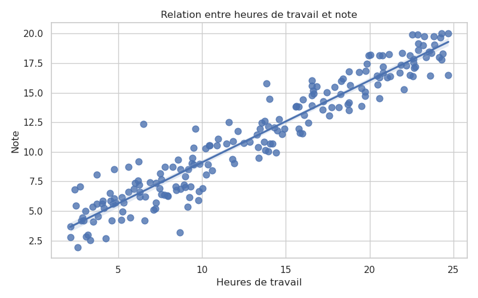

Documentation individuelle

TP INF232 – Analyse des données

Étudiante : EPOLLE NJIMAN MARIETTE ERICKA
Matricule : 23V2417

Responsabilité

Dans le cadre du projet de TP INF232, j'étais responsable du développement du fichier 06_visualisations.py ainsi que de la préparation des figures destinées au rapport final.

Mon travail consistait principalement à centraliser les différentes visualisations réalisées au cours des Questions 1 à 4, à leur donner une présentation homogène et à préparer leur intégration dans le rapport final. L'objectif était que toutes les figures du projet aient le même style graphique afin d'améliorer la lisibilité des résultats.

 1. Graphiques produits et leur source

Le fichier 06_visualisations.py permet de regrouper les principales visualisations du projet.

Les graphiques concernés sont les suivants :

| Graphique                                           | Source     |
| --------------------------------------------------- | ---------- |
| Histogramme des notes                               | Question 1 |
| Boîte à moustaches des notes                        | Question 1 |
| Régression entre les heures de travail et les notes | Question 2 |
| Clusters d'élèves                                   | Question 3 |
| Matrice de confusion                                | Question 4 |

Les Questions 3 et 4 utilisent les résultats produits par les membres responsables de ces parties. Mon fichier est conçu pour récupérer ces résultats afin de générer des figures ayant une présentation uniforme.

 Figure 1 – Distribution des notes

Figure 2 – Boîte à moustaches

Figure 3 – Régression entre les heures de travail et les notes

Figure 4 – Clusters d'élèves

Figure 5 – Matrice de confusion

| Graphique                                           | Source     |
| --------------------------------------------------- | ---------- |

 2. Utilité de chaque visualisation

Chaque graphique apporte une information différente sur les données étudiées.

 Histogramme des notes
L'histogramme permet d'observer la répartition générale des notes des élèves. Il montre les intervalles de notes les plus fréquents et donne une première idée de la dispersion des résultats.

 Boîte à moustaches
Cette représentation permet de visualiser rapidement la médiane, les quartiles ainsi que les éventuelles valeurs atypiques. Elle est utile pour résumer la distribution des notes.

 Régression heures de travail / note
Ce graphique permet d'étudier la relation entre le temps de travail des élèves et leur note. La droite de régression aide à visualiser une éventuelle corrélation entre ces deux variables.

 Clusters d'élèves
Le graphique des clusters permet d'observer les groupes d'élèves obtenus après l'application de l'algorithme de regroupement. Cette représentation facilite l'interprétation des différents profils présents dans les données.

 Matrice de confusion
La matrice de confusion est utilisée pour évaluer les performances du modèle de classification. Elle compare les classes réelles aux classes prédites et met en évidence les erreurs de prédiction.

 3. Choix de présentation

Afin d'obtenir une présentation cohérente dans l'ensemble du projet, plusieurs choix ont été effectués.

* utilisation de Seaborn pour améliorer l'apparence des graphiques ;
* application du thème whitegrid afin d'améliorer la lisibilité ;
* utilisation d'une taille identique pour toutes les figures (8 × 5 pouces) ;
* ajout systématique d'un titre et des noms des axes ;
* utilisation de couleurs adaptées selon le type de graphique (Viridis pour les clusters et Blues pour la matrice de confusion) ;
* utilisation de tight_layout() afin d'éviter le chevauchement des éléments ;
* export automatique des figures au format PNG dans le dossier figures/.

Ces choix permettent d'obtenir un rendu homogène et facilitent la lecture des résultats.

 4. Intégration des figures dans le rapport

Les figures générées sont destinées à être insérées directement dans le rapport final du projet.

Pour garantir une bonne présentation, il est recommandé :

* d'insérer chaque figure après son explication ;
* de numéroter les figures (Figure 1, Figure 2, etc.) ;
* d'ajouter une légende descriptive sous chaque image ;
* de conserver une taille identique pour toutes les figures ;
* d'indiquer la question du projet (Q1, Q2, Q3 ou Q4) à laquelle la figure est associée.

Cette organisation facilite la lecture du rapport et permet de retrouver rapidement les résultats correspondant à chaque partie du projet.

 5. Les cinq points clés à retenir

a. Le fichier 06_visualisations.py regroupe les principales visualisations produites dans le projet.
b. Les figures sont exportées automatiquement au format PNG dans le dossier figures/.
c. Une présentation graphique uniforme a été adoptée afin de rendre le rapport plus lisible.
d. Chaque graphique apporte une information utile pour comprendre les résultats obtenus.
e. Les figures sont directement exploitables pour la rédaction du rapport final.

